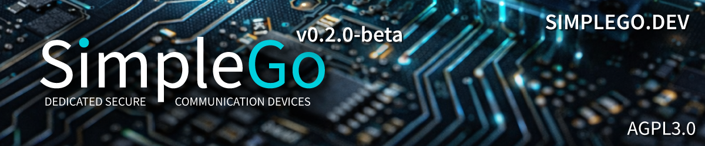

<p align="center">
  
</p>

# SimpleGo

**Encrypted communication and IoT on dedicated hardware. No smartphone, no cloud, no compromises.**

[](LICENSE)
[](#license)
[](#status)
[](#getting-started)
[](https://wiki.simplego.dev)

## What is SimpleGo?

SimpleGo is an open-source platform for encrypted communication and secure data transmission on dedicated microcontroller hardware. It combines private messaging with IoT sensor monitoring and remote device control in a single, auditable firmware stack.

The core idea is simple: sensitive data belongs on hardware you control, transmitted through channels nobody else can read. Whether that data is a text message, a temperature reading from a medical sensor, or a command to a remote access system.

SimpleGo runs on affordable off-the-shelf hardware, operates its own relay infrastructure, and is built entirely in C with a codebase small enough to audit.

## Use Cases

### Private Messaging

Turn on the device, connect to WiFi, scan a QR code, and start chatting. Messages are end-to-end encrypted with perfect forward secrecy. There are no accounts, no phone numbers, and no usernames. Your keys never leave your device.

### Medical and Health Monitoring

Transmit patient data, sensor readings from wearable monitors, or equipment status in compliance with data protection regulations. End-to-end encryption ensures that sensitive health information cannot be intercepted or correlated to an individual during transmission.

### Industrial Sensor Networks

Collect and transmit data from environmental sensors, production equipment, or infrastructure monitoring systems. Encrypted channels prevent data manipulation and protect operational intelligence from interception. Relevant for water treatment, energy infrastructure, manufacturing, and any environment where SCADA security matters.

### Agriculture and Environmental Monitoring

Transmit soil moisture, weather station data, and irrigation commands across remote locations. Encrypted communication protects operational data from competitors and prevents unauthorized access to automated systems.

### Building Security and Access Control

Manage door locks, alarm systems, and surveillance infrastructure through encrypted channels. Unencrypted building automation is an open invitation. SimpleGo ensures that commands and sensor states cannot be intercepted or spoofed.

### Emergency and Disaster Communication

When cellular networks fail, SimpleGo devices can communicate over WiFi and local networks without depending on centralized infrastructure. Planned LoRa support will extend this to long-range off-grid scenarios.

### Fleet and Asset Tracking

Monitor location, temperature, and status of sensitive shipments. End-to-end encryption prevents logistics providers or third parties from building movement profiles or accessing cargo information.

### Journalism and Human Rights

Deploy environmental sensors or communication relays in regions where monitoring is dangerous. Anonymized data transmission protects both the source and the operator.

## Features

### Communication
- End-to-end encrypted messaging with perfect forward secrecy
- No accounts, no phone numbers, no persistent identity
- 128 simultaneous contacts with individual encryption keys
- Encrypted chat history on SD card (AES-256-GCM)
- Delivery receipts (double checkmarks)
- Compatible with existing SMP-based messaging apps
- Independent relay servers operated by SimpleGo

### Hardware
- Physical QWERTY keyboard and 320x240 color display
- WiFi manager with multi-network support and WPA3
- Hardware Abstraction Layer for easy porting to new devices
- Runs on affordable off-the-shelf microcontroller boards ($50-70)

### IoT and Sensors (in development)
- Encrypted sensor data transmission
- Remote device monitoring and control
- Configurable data channels with per-sensor encryption keys
- LoRa support for long-range off-grid deployments (planned)

### Security
- Multiple independent encryption layers per message
- Post-quantum key exchange (sntrup761 Streamlined NTRU Prime)
- All traffic padded to fixed block size (no metadata leakage)
- Keys stored on-device with hardware-backed encryption (production release)
- Bare-metal firmware with no OS, no browser, no background services
- 22,000+ lines of C across 47 source files (fully auditable)
- Open source under AGPL-3.0

## Getting Started

SimpleGo runs on the [LilyGo T-Deck Plus](https://www.lilygo.cc/products/t-deck-plus), available for around $50-70.

### Prerequisites

| Component | Version | Notes |
|-----------|---------|-------|
| ESP-IDF | 5.5.2 (recommended) or 5.5.3 | [Installation Guide](https://docs.espressif.com/projects/esp-idf/en/v5.5.2/esp32s3/get-started/) |
| Python | 3.9+ | Required by ESP-IDF |
| CMake | 3.16+ | Included with ESP-IDF |
| Git | Any recent version | For cloning the repository |

### Step 1: Install ESP-IDF

Follow the [official ESP-IDF installation guide](https://docs.espressif.com/projects/esp-idf/en/v5.5.2/esp32s3/get-started/) for your platform.

**Linux / macOS:**
```bash
mkdir -p ~/esp && cd ~/esp
git clone -b v5.5.2 --recursive https://github.com/espressif/esp-idf.git
cd esp-idf
./install.sh esp32s3
source export.sh
```

**Windows:**

Download and run the [ESP-IDF Offline Installer](https://dl.espressif.com/dl/esp-idf/) for version 5.5.2. After installation, open "ESP-IDF 5.5 PowerShell" from the Start menu.

### Step 2: Apply mbedTLS Patches (Required)

SimpleX relay servers use ED25519 certificates. The ESP-IDF version of mbedTLS does not support ED25519 natively. SimpleGo includes patches that add compatibility. This step is required for TLS connections to work.

**Linux / macOS:**
```bash
cd SimpleGo
chmod +x patches/apply_patches.sh
./patches/apply_patches.sh
```

**Windows (PowerShell):**
```powershell
cd SimpleGo
.\patches\apply_patches.ps1
```

See [patches/README.md](patches/README.md) for details on what the patches change and why.

### Step 3: Build and Flash

**Linux / macOS:**
```bash
cd SimpleGo
idf.py build
idf.py flash -p /dev/ttyACM0
idf.py monitor -p /dev/ttyACM0
```

**Windows (ESP-IDF PowerShell):**
```powershell
cd SimpleGo
idf.py build
idf.py flash monitor -p COM6
```

WiFi credentials are entered on the device itself at first boot. No menuconfig required.

### Tested Build Environments

| OS | ESP-IDF | Compiler | Status |
|----|---------|----------|--------|
| Windows 11 | 5.5.2 | xtensa-esp-elf-gcc 14.2.0 | Working |
| Ubuntu 24.04 (WSL2) | 5.5.2 | xtensa-esp-elf-gcc 14.2.0 | Working |
| Ubuntu (native) | 5.5.2 | xtensa-esp-elf-gcc 14.2.0 | Working |
| Ubuntu (native) | 5.5.3 | xtensa-esp-elf-gcc 14.2.0 | Working (with patches) |

### Troubleshooting

| Problem | Solution |
|---------|----------|
| TLS handshake failed: -0x7780 | mbedTLS patches not applied. Run the apply_patches script. |
| wolfssl_config not found | Update your clone. Run `git pull` and rebuild. |
| ui/widgets does not exist | Update your clone. Run `git pull` and rebuild. |
| LVGL not found | LVGL is downloaded automatically on first build via ESP-IDF component manager. |
| Serial port busy or not found | Close other terminals. Check port with device manager (Windows) or `ls /dev/ttyACM*` (Linux). |
| Linux: format specifier errors | Update your clone. All `%u` / PRIu32 issues have been fixed. |

## Hardware

SimpleGo is built around a Hardware Abstraction Layer (HAL). The entire protocol stack and application logic are device-independent. Adding a new hardware platform means implementing five interface files. Everything above the HAL comes for free.

### Current Platform

| | |
|---|---|
| **Device** | LilyGo T-Deck Plus |
| **MCU** | ESP32-S3, dual-core 240 MHz, 8 MB PSRAM |
| **Display** | 320x240 LCD with touch |
| **Input** | Physical QWERTY keyboard, trackball |
| **Connectivity** | WiFi 802.11 b/g/n |
| **Storage** | MicroSD for encrypted data storage |

### Planned Platforms

Custom PCB designs with hardware secure elements, LoRa connectivity, and optional LTE are in development for professional and industrial deployments. See [Hardware Documentation](https://wiki.simplego.dev/hardware) for details.

## Architecture

```
+---------------------------------------------------------------+
|                     APPLICATION LAYER                         |
|          Messaging / IoT Sensors / Remote Control             |
+---------------------------------------------------------------+
|                      PROTOCOL LAYER                           |
|         Encryption / Key Management / Data Channels           |
+---------------------------------------------------------------+
|               HARDWARE ABSTRACTION LAYER                      |
|       hal_display / hal_input / hal_network / hal_storage     |
+---------------+---------------+---------------+---------------+
|  T-Deck Plus  |  T-Deck Pro   |  Custom PCB   |   Desktop     |
|  ESP32-S3     |  ESP32-S3     |  STM32 + SE   |   SDL2 Test   |
+---------------+---------------+---------------+---------------+
```

## Encryption Stack

Every message passes through four independent encryption layers:

| Layer | Algorithm | Purpose |
|-------|-----------|---------|
| 1. End-to-End | X3DH (X448) + Double Ratchet + AES-256-GCM | Perfect forward secrecy, post-compromise security |
| 2. Per-Queue | X25519 + XSalsa20 + Poly1305 | Prevents traffic correlation between queues |
| 3. Server-to-Recipient | NaCl cryptobox | Prevents correlation of incoming/outgoing server traffic |
| 4. Transport | TLS 1.3 (mbedTLS) | Network-level protection |

Post-quantum key exchange using sntrup761 (Streamlined NTRU Prime) is integrated and active, providing quantum-resistant encryption from the first message.

## Project Structure

```
SimpleGo/
+-- main/
|   +-- core/           # Task architecture, frame pool
|   +-- crypto/         # X448, AES-GCM, NaCl, sntrup761
|   +-- hal/            # HAL interface headers
|   +-- include/        # Shared header files
|   +-- net/            # Network, TLS, WiFi manager
|   +-- protocol/       # SMP protocol, ratchet, handshake
|   +-- state/          # Contacts, history, peer connections
|   +-- ui/             # LVGL screens, themes, fonts
|   +-- util/           # Shared utilities
+-- devices/
|   +-- t_deck_plus/    # LilyGo T-Deck Plus HAL implementation
|   +-- template/       # Template for new device ports
+-- components/         # External libraries (sntrup761, zstd, wolfssl_config)
+-- patches/            # mbedTLS ED25519 compatibility patches
+-- docs/               # Documentation
+-- wiki/               # Docusaurus wiki source
```

## Status

This is alpha software under active development. The core messaging stack is functional and tested with multiple simultaneous contacts. IoT and sensor functionality is in the design phase.

| Component | Status |
|-----------|--------|
| Encrypted messaging | Working |
| Multi-contact (128) | Working |
| Post-quantum key exchange (sntrup761) | Working |
| Delivery receipts | Working |
| WiFi manager | Working |
| Encrypted data storage (AES-256-GCM) | Working |
| Screen lock (60s inactivity) | Working |
| Cross-platform build (Windows + Linux) | Working |
| IoT sensor channels | Design phase |
| Remote device control | Design phase |
| LoRa connectivity | Planned |
| Web Serial Installer | Planned |

## Documentation

- [wiki.simplego.dev](https://wiki.simplego.dev) - Full documentation
- [Architecture](https://wiki.simplego.dev/architecture) - System design
- [Security](https://wiki.simplego.dev/security) - Security model
- [Hardware](https://wiki.simplego.dev/hardware) - Device specifications and porting
- [patches/README.md](patches/README.md) - mbedTLS patch documentation
- [Protocol Analysis](docs/protocol-analysis/) - Implementation journal

## Contributing

See [CONTRIBUTING.md](CONTRIBUTING.md) for guidelines. All code must build on both Windows and Linux (see [CODING_RULES.md](CODING_RULES.md)).

Security vulnerabilities should be reported privately via GitHub's vulnerability reporting feature.

## License

| Component | License |
|-----------|---------|
| Software | [AGPL-3.0](LICENSE) |
| Hardware | CERN-OHL-W-2.0 |

## Acknowledgments

- [Espressif](https://www.espressif.com/) for ESP-IDF and the ESP32 platform
- [LVGL](https://lvgl.io/) for the embedded graphics library
- [mbedTLS](https://github.com/Mbed-TLS/mbedtls) for TLS and cryptography
- [wolfSSL](https://www.wolfssl.com/) for X448 key agreement
- [libsodium](https://doc.libsodium.org/) for NaCl cryptographic operations
- [PQClean](https://github.com/PQClean/PQClean) for sntrup761 post-quantum cryptography

---

*SimpleGo is an independent open-source project by IT and More Systems, Recklinghausen, Germany. SimpleGo uses the open-source SimpleX Messaging Protocol (AGPL-3.0) for interoperable message delivery. It is not affiliated with or endorsed by any third party. See [docs/DISCLAIMER.md](docs/DISCLAIMER.md) for full legal notices.*

<p align="center">
  <b>SimpleGo - Encrypted communication and IoT on dedicated hardware.</b>
</p>