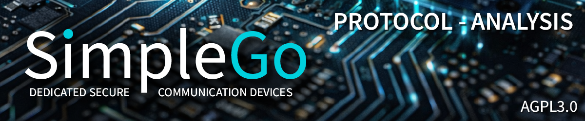

# SimpleX Protocol Analysis - Documentation Index

**Project:** SimpleGo - Native ESP32 SMP Implementation
**Version:** v0.1.18-alpha
**Last Updated:** 2026-03-21 (Session 49 -- Queue Rotation: From Zero to Working)

---

## LATEST: Queue Rotation from Zero to Working (Session 49)

Longest session (4 days). Queue Rotation implemented: QADD/QKEY/QUSE/QTEST protocol with live server switch, no reboot. 7 QADD format iterations uncovered 3 critical undocumented rules (client versions v1-v4, replacedSndQueue=Nothing forbidden, per-contact snd_id required). Multi-server: 21 presets, radio-button UI, SEC-07 fingerprint at 4 TLS points. Bug #32 closed. Dual-TLS confirmed ~1,500 bytes SRAM per connection. Bidirectional chat verified after live server switch with PQ crypto.

Bugs: 81 total (Bug #32 closed, 6 rotation issues known)
Lessons: 270 total (13 new in S49: #258-#270)

## PREVIOUS: Performance + Statusbar + Splash + Matrix + Reconnect (Session 48)

## PREVIOUS: UX Overhaul, NVS Resize, PQ UI (Session 47)

## PREVIOUS: Consolidation and Quality Pass (Session 42)

Session 42 was a pure consolidation session. No new features. Production-grade code hygiene, architectural correctness, and AGPL-3.0 license compliance across all 47 source files:

- smp_handshake.c debug cleanup: 74 lines removed, zero printf in production
- smp_globals.c dissolved: 7 symbols migrated to owning modules, file deleted
- smp_app_run() refactored: 530 lines to 118 lines via 5 static helpers
- License headers: all 47 source files standardized (AGPL-3.0, SPDX)
- extern TODO markers resolved, re-delivery log verified correct

Bugs: 71 total (no new bugs, structural changes only)
Lessons: 229 total (4 new in S42: #226-#229)

## PREVIOUS: Pre-GitHub Cleanup (Session 41)

Session 40 implemented a three-stage sliding window architecture for unlimited encrypted chat history at constant memory consumption. Three-stage pipeline: SD Card (unlimited, AES-256-GCM) to PSRAM Cache (30 messages) to LVGL Window (5 bubbles, ~6KB). Crypto-separation from SPI mutex (500ms to < 10ms). Bidirectional scroll with re-entrancy guard.

## PREVIOUS: On-Device WiFi Manager (Session 39)

On February 28 - March 1, 2026, Session 38 added backlight control and identified the display freeze root cause:

- **Display Backlight:** GPIO 42 pulse-counting (16 levels)
- **Keyboard Backlight:** I2C 0x55 with auto-off timer
- **Settings Screen:** Brightness sliders + gear button
- **WiFi/LWIP → PSRAM:** 56KB internal SRAM freed
- **Root Cause Found:** SPI2 bus sharing (display + SD card)
- **8 Hypotheses Tested:** 7 wrong, 1 correct (SD removal = stable!)
- **LVGL Heap Discovery:** Separate 64KB pool, ~8 bubbles max

**Bugs: 61 total (2 new in S38: #60-#61)**
**Lessons Learned:** 209 total (5 new in S38)

## PREVIOUS: Encrypted Chat History (Session 37)

On February 25-27, 2026, Session 37 implemented encrypted chat persistence:

- **AES-256-GCM Encrypted History:** Per-contact HKDF-SHA256 key derivation
- **Append-Only SD Storage:** /sdcard/simplego/msgs/chat_XX.bin
- **SPI2 Bus Serialization:** LVGL mutex for display + SD collision
- **DMA Draw Buffer Fix:** Moved to internal SRAM (anti-tearing)
- **Chunked Rendering:** 3 bubbles/tick progressive loading
- **Contact List Redesign:** 28px single-line cards, search, bottom bar

**Bugs: 59 total (2 new in S37: #58-#59)**
**Lessons Learned:** 204 total (2 new in S37)

## PREVIOUS: Contact Lifecycle (Session 36)

On February 25, 2026, Session 36 completed the full contact lifecycle:

- **NTP Timestamps:** Real clock in chat bubbles (Mon | 14:35)
- **Contact Name from ConnInfo:** displayName extracted from JSON
- **NVS 4-Key Cleanup:** rat_XX, peer_XX, hand_XX, rq_XX on delete
- **KEY-HELLO Race Condition:** FreeRTOS TaskNotification sync
- **UI Cleanup on Delete:** Bubbles cleared, QR reset, stale cache gone
- **Contact List Redesign:** Long-press menu with Delete and Info
- **Full Lifecycle Verified:** Create → Chat → Delete → Recreate (no erase-flash!)

**Bugs: 57 total (7 new in S36: #51-#57 + Bug E)**
**Lessons Learned:** 202 total (10 new in S36)

## PREVIOUS: Multi-Contact Victory (Session 35)

On February 24, 2026, Session 35 fixed all remaining multi-contact bugs:

- **Ratchet Slot Ordering:** set_active BEFORE process_message
- **KEY Target Queue:** Reply Queue (not Contact Queue)
- **Per-Contact Chat Filter:** Bubble tagging + LV_OBJ_FLAG_HIDDEN
- **PSRAM Guard:** Prevents NVS overwrite of active session
- **NVS Fallback:** Contact >0 PSRAM loads from NVS after boot
- **Verified:** 2 contacts, bidirectional, receipts, 20+ messages, erase-flash tested

**Bugs: 50 total (no new protocol bugs in S35)**
**Lessons Learned:** 192 total (6 new in S35)

---

## Documentation Structure

The complete protocol analysis (~33,000+ lines, 670+ sections) is split into 46 parts:

| Part | File | Lines | Content |
|------|------|-------|---------|
| 1 | [03_PART1_INTRO_SESSIONS_1-2.md](03_PART1_INTRO_SESSIONS_1-2.md) | ~2,300 | Introduction, Foundation, TLS 1.3 |
| 2 | [04_PART2_SESSIONS_3-4.md](04_PART2_SESSIONS_3-4.md) | ~1,000 | Wire format, Bugs #1-8 |
| 3 | [05_PART3_SESSIONS_5-6.md](05_PART3_SESSIONS_5-6.md) | ~800 | X448 breakthrough, SMPQueueInfo |
| 4 | [06_PART4_SESSION_7.md](06_PART4_SESSION_7.md) | ~3,200 | AES-GCM verification, Tail encoding |
| 5 | [07_PART5_SESSION_8.md](07_PART5_SESSION_8.md) | ~400 | AgentConfirmation works! |
| 6 | [08_PART6_SESSION_9.md](08_PART6_SESSION_9.md) | ~450 | Reply Queue HSalsa20 fix |
| 7 | [09_PART7_SESSION_10.md](09_PART7_SESSION_10.md) | ~400 | cmNonce fix, app "connecting" |
| 8 | [10_PART8_SESSION_11.md](10_PART8_SESSION_11.md) | ~400 | Regression & Recovery |
| 9 | [11_PART9_SESSION_12.md](11_PART9_SESSION_12.md) | ~400 | E2E Keypair Fix Attempt |
| 10 | [12_PART10_SESSION_13.md](12_PART10_SESSION_13.md) | ~700 | E2E Crypto Deep Analysis |
| 11 | [13_PART11_SESSION_14.md](13_PART11_SESSION_14.md) | ~900 | DH SECRET VERIFIED! |
| 12 | [14_PART12_SESSION_15.md](14_PART12_SESSION_15.md) | ~650 | Root Cause Found |
| 13 | [15_PART13_SESSION_16.md](15_PART13_SESSION_16.md) | ~900 | Custom XSalsa20 + Double Ratchet |
| 14 | [16_PART14_SESSION_17.md](16_PART14_SESSION_17.md) | ~500 | Key Consistency Debug |
| 15 | [17_PART15_SESSION_18.md](17_PART15_SESSION_18.md) | ~600 | BUG #18 SOLVED! E2E SUCCESS |
| 16 | [18_PART16_SESSION_19.md](18_PART16_SESSION_19.md) | ~550 | Header Decrypt SUCCESS! |
| 17 | [19_PART17_SESSION_20.md](19_PART17_SESSION_20.md) | ~600 | Body Decrypt! Peer Profile! |
| 18 | [20_PART18_SESSION_21.md](20_PART18_SESSION_21.md) | ~700 | v3 Format + HELLO Debugging |
| 19 | [21_PART19_SESSION_22.md](21_PART19_SESSION_22.md) | ~600 | Reply Queue Flow Discovery |
| 20 | [22_PART20_SESSION_23.md](22_PART20_SESSION_23.md) | ~570 | CONNECTED! Historic Milestone! |
| 21 | [23_PART21_SESSION_24.md](23_PART21_SESSION_24.md) | ~600 | First Chat Message! Milestone #2! |
| **22** | [**24_PART22_SESSION_25.md**](24_PART22_SESSION_25.md) | **~480** | ** Bidirectional + Receipts! M3,4,5!** |
| **23** | [**25_PART23_SESSION_26.md**](25_PART23_SESSION_26.md) | **~600** | ** Persistence! Milestone 6!** |
| **24** | [**26_PART24_SESSION_27.md**](26_PART24_SESSION_27.md) | **~650** | ** FreeRTOS Architecture Investigation** |
| **25** | [**27_PART25_SESSION_28.md**](27_PART25_SESSION_28.md) | **~550** | ** Phase 2b Success -- Tasks Running!** |
| **26** | [**28_PART26_SESSION_29.md**](28_PART26_SESSION_29.md) | **~750** | ** Multi-Task Architecture BREAKTHROUGH!** |
| **27** | [**29_PART27_SESSION_30.md**](29_PART27_SESSION_30.md) | **~660** | ** Intensive Debug -- 10 Hypotheses, 14 Fixes** |
| **28** | [**30_PART28_SESSION_31.md**](30_PART28_SESSION_31.md) | **~850** | ** Bidirectional Chat Restored! Milestone 7!** |
| **29** | [**31_PART29_SESSION_32.md**](31_PART29_SESSION_32.md) | **~500** | ** "The Demonstration" -- From Protocol to Messenger** |
| **30** | [**32_PART30_SESSION_34.md**](32_PART30_SESSION_34.md) | **~473** | ** Multi-Contact Architecture -- Per-Contact Reply Queue** |
| **31** | [**33_PART31_SESSION_34_BREAKTHROUGH.md**](33_PART31_SESSION_34_BREAKTHROUGH.md) | **~545** | ** Multi-Contact Bidirectional -- 11 Bugs, HISTORIC MILESTONE** |
| **32** | [**34_PART32_SESSION_35.md**](34_PART32_SESSION_35.md) | **~304** | ** Multi-Contact Victory -- All Planned Bugs Fixed** |
| **33** | [**35_PART33_SESSION_36.md**](35_PART33_SESSION_36.md) | **~389** | ** Contact Lifecycle: Delete, Recreate, Zero Compromise** |
| **34** | [**36_PART34_SESSION_37.md**](36_PART34_SESSION_37.md) | **~332** | ** Encrypted Chat History: SD Card, SPI Bus Wars** |
| **35** | [**37_PART35_SESSION_38.md**](37_PART35_SESSION_38.md) | **~324** | ** The SPI2 Bus Hunt: Eight Hypotheses, One Root Cause** |
| **36** | [**38_PART36_SESSION_39.md**](38_PART36_SESSION_39.md) | **~310** | **WiFi Manager: First On-Device WiFi Setup for T-Deck** |
| **37** | [**39_PART37_SESSION_40.md**](39_PART37_SESSION_40.md) | **~273** | **Sliding Window: Unlimited Encrypted History at Constant Memory** |
| **38** | [**40_PART38_SESSION_41.md**](40_PART38_SESSION_41.md) | **~145** | ** Pre-GitHub Cleanup and Stabilization** |
| **39** | [**41_PART39_SESSION_42.md**](41_PART39_SESSION_42.md) | **~130** | ** Consolidation and Quality Pass** |
| **40** | [**42_PART40_SESSION_43.md**](42_PART40_SESSION_43.md) | **~210** | ** Documentation + Security Cleanup + Display Name** |
| **41** | [**43_PART41_SESSION_44.md**](43_PART41_SESSION_44.md) | **~155** | ** Hardware Class 1 Security Architecture** |
| **42** | [**44_PART42_SESSION_45.md**](44_PART42_SESSION_45.md) | **~155** | ** Security Implementation: 4 Findings Closed (SEC-01/02/04/05)** |
| **43** | [**45_PART43_SESSION_46.md**](45_PART43_SESSION_46.md) | **~230** | ** MEGABLAST: Post-Quantum Double Ratchet - World First** |
| **44** | [**46_PART44_SESSION_47.md**](46_PART44_SESSION_47.md) | **~200** | ** UX Overhaul: NVS 1 MB, QR 16-Stage Flow, PQ UI** |
| **45** | [**47_PART45_SESSION_48.md**](47_PART45_SESSION_48.md) | **~190** | ** Performance + Statusbar + Splash + Matrix + Reconnect (16h)** |
| **46** | [**48_PART46_SESSION_49.md**](48_PART46_SESSION_49.md) | **~220** | ** Queue Rotation: QADD/QKEY/QUSE/QTEST, Live Server Switch** |
| **Total** | | **~33,000+** | **670+ Sections** |

---

## Quick Reference Documents

| Document | Lines | Description |
|----------|-------|-------------|
| [README.md](README.md) | ~1,370 | Project overview and navigation |
| [BUG_TRACKER.md](BUG_TRACKER.md) | ~2,800 | All 71 bugs documented, 232 lessons |
| [QUICK_REFERENCE.md](QUICK_REFERENCE.md) | ~3,000 | Constants, wire formats, verified values |

---

## Session Overview

| Session | Date | Focus | Result |
|---------|------|-------|--------|
| 1-3 | Dec 2025 | Foundation | TLS 1.3, Basic SMP |
| 4 | Jan 23, 2026 | Wire Format | Bugs #1-8 fixed |
| 5 | Jan 24, 2026 | Crypto | X448 byte-order (Bug #9) |
| 6 | Jan 24, 2026 | Handshake | SMPQueueInfo (Bugs #10-12) |
| 7 | Jan 24-25, 2026 | Research | First native SMP confirmed! |
| 8 | Jan 27, 2026 | **BREAKTHROUGH** | AgentConfirmation works! (Bugs #13-14) |
| 9 | Jan 27, 2026 | Reply Queue | HSalsa20 fix (Bugs #15-16) |
| 10C | Jan 28, 2026 | E2E Layer | cmNonce fix (Bug #17) |
| 11 | Jan 30, 2026 | Recovery | Regression fixed |
| 12-13 | Jan 30, 2026 | Analysis | E2E Crypto Deep Dive |
| 14 | Jan 31 - Feb 1 | Verification | DH SECRET VERIFIED! |
| 15 | Feb 1, 2026 | Root Cause | Theory (later disproven) |
| 16 | Feb 1-3, 2026 | Custom Crypto | XSalsa20 + Double Ratchet |
| 17 | Feb 4, 2026 | Debug | Key Consistency |
| 18 | Feb 5, 2026 | **SOLVED** | Bug #18 ONE LINE FIX! |
| 19 | Feb 5, 2026 | Header | Header Decrypt SUCCESS! (Bug #19) |
| 20 | Feb 6, 2026 | **PROFILE** | Body Decrypt! Peer Profile! |
| 21 | Feb 6-7, 2026 | HELLO | v3 Format (Bugs #20-26) |
| 22 | Feb 7, 2026 | DISCOVERY | Reply Queue Flow (Bugs #27-31) |
| **23** | **Feb 7-8, 2026** | **CONNECTED** | ** First SimpleX on Microcontroller!** |
| **24** | **Feb 11-13, 2026** | **FIRST A_MSG** | ** First Chat Message!** |
| **25** | **Feb 13-14, 2026** | **BIDIRECTIONAL** | ** Chat + Receipts! (8 bugs)** |
| **26** | **Feb 14, 2026** | **PERSISTENCE** | ** Milestone 6! Ratchet State Persistence** |
| **27** | **Feb 14-15, 2026** | **ARCHITECTURE** | ** FreeRTOS Investigation (17 lessons)** |
| **28** | **Feb 15, 2026** | **TASKS** | ** Phase 2b Success -- 3 Tasks Running!** |
| **29** | **Feb 16, 2026** | **ARCHITECTURE** | ** Multi-Task BREAKTHROUGH!** |
| **30** | **Feb 16-18, 2026** | **DEBUG** | ** 10 Hypotheses, 14 Fixes, Awaiting Evgeny** |
| **31** | **Feb 18, 2026** | **RESOLVED** | ** Bidirectional Restored! Milestone 7!** |
| **32** | **Feb 19-20, 2026** | **UI** | ** "The Demonstration" -- Full Messenger UI** |
| **34** | **Feb 23, 2026** | **ARCHITECTURE** | ** Multi-Contact -- Per-Contact Reply Queue** |
| **34b** | **Feb 24, 2026** | **BREAKTHROUGH** | ** Multi-Contact Bidirectional -- 11 Bugs Fixed!** |
| **35** | **Feb 24, 2026** | **VICTORY** | ** All Planned Bugs Fixed -- Chat Filter Working!** |
| **36** | **Feb 25, 2026** | **LIFECYCLE** | ** Contact Lifecycle: Delete, Recreate, Zero Compromise** |
| **37** | **Feb 25-27, 2026** | **HISTORY** | ** Encrypted Chat History: SD Card, SPI Bus Wars** |
| **38** | **Feb 28 - Mar 1, 2026** | **SPI HUNT** | ** Eight Hypotheses, One Root Cause** |
| **39** | **Mar 3, 2026** | **WIFI** | ** First On-Device WiFi Manager for T-Deck** |
| **40** | **Mar 3-4, 2026** | **WINDOW** | **Sliding Window: Unlimited Encrypted History** |
| **41** | **Mar 4, 2026** | **CLEANUP** | ** Pre-GitHub Cleanup and Stabilization** |
| **42** | **Mar 4-5, 2026** | **QUALITY** | ** Consolidation and Quality Pass** |
| **43** | **Mar 5-8, 2026** | **DOCS+SEC+UX** | ** Wiki + Security Cleanup + Display Name + Bug #20** |
| **44** | **Mar 8, 2026** | **SECURITY** | ** Hardware Class 1 Security Architecture (15 docs, 3,243 lines)** |
| **45** | **Mar 10, 2026** | **SECURITY** | ** 4 Findings Closed (SEC-01/02/04/05), HMAC NVS Vault Live** |
| **46** | **Mar 11-12, 2026** | **MEGABLAST** | ** Post-Quantum Double Ratchet - World First! 6/6 SEC CLOSED** |
| **47** | **Mar 15-16, 2026** | **UX** | ** 7 Bugs, NVS 1 MB, QR 16-Stage Flow, PQ UI, Per-Contact PQ Abandoned** |
| **48** | **Mar 16-17, 2026** | **MEGA SESSION** | ** Bug #30+#31, Statusbar, Splash, Matrix, Reconnect (16h, 23 files)** |
| **49** | **Mar 18-21, 2026** | **QUEUE ROTATION** | ** QADD/QKEY/QUSE/QTEST, Live Server Switch, 21 Servers, SEC-07 (4 days)** |

---

## Key Achievements

### COMPLETE MULTI-TASK BIDIRECTIONAL CHAT (Session 31)
- TLS 1.3 Handshake
- SMP Protocol (Contact + Reply Queues)
- X3DH Key Agreement
- Double Ratchet Header+Body Decrypt
- E2E Encrypt/Decrypt both directions
- A_MSG Send + Receive
- Delivery Receipts ()
- **Ratchet State Persistence (NVS)**
- **ESP32 survives reboot!**
- **ESP32 ↔ SimpleX App -- Full Chat!**
- Zstd Decompression
- ConnInfo JSON Parsing
- Peer Profile on ESP32: `"displayName": "cannatoshi"`
- TLS Reconnect to Reply Queue
- SUB + KEY Commands
- HELLO Exchange (both directions)
- **CON -- "CONNECTED"!**
- **FreeRTOS Multi-Task Architecture**
- **TCP Keep-Alive + SMP PING/PONG**
- **Batched txCount > 1 Handling**
- **TX2 MSG Forwarding**
- **Re-Delivery Detection**
- **Milestone 7: Multi-Task Bidirectional Chat**
- **LVGL Keyboard Integration (T-Deck HW)**
- **Delivery Status: ... → → → **
- **Receipt Parsing (inner_tag 'V')**
- **UI Event Queue (app_to_ui_queue)**
- **128-Contact PSRAM Architecture**
- **Production Cleanup (zero private keys in logs)**
- **Runtime Add-Contact (NET_CMD via Ring Buffer)**
- **Per-Contact 42d Tracking (128-bit bitmap)**
- **Per-Contact Reply Queue (128 slots, ~49KB PSRAM)**
- **SMP v7 Signing Fix (1-byte session prefix)**
- **PSRAM Total: ~158KB / 8MB (1.9%)**
- **KEY Command Fix (Contact Queue credentials)**
- **Ghost Write Elimination (5 errors in reply_queue_create)**
- **Global State Elimination (peer_prepare_for_contact)**
- **Reply Queue Encoder Fix (byte-identical)**
- **Crypto Fix (beforenm vs scalarmult)**
- **Contact 0 + Contact 1 Bidirectional Encrypted**
- **MILESTONE 10: Multi-Contact Bidirectional Messaging**
- **Per-Contact Chat Filter (bubble tagging + HIDDEN)**
- **Ratchet Slot Ordering Fix (set_active BEFORE decrypt)**
- **KEY Targets Reply Queue (not Contact Queue)**
- **PSRAM Guard + NVS Fallback for Contact >0**
- **MILESTONE 11: Multi-Contact Chat Filter**
- **NTP Timestamps in Chat Bubbles (SNTP sync)**
- **Contact Name from ConnInfo JSON (displayName)**
- **4-Key NVS Cleanup on Delete (rat/peer/hand/rq)**
- **KEY-HELLO Race Condition Fix (TaskNotification)**
- **UI Cleanup on Delete (bubbles + QR reset)**
- **Contact List Redesign (665 lines, long-press menu)**
- **Full Contact Lifecycle (create/chat/delete/recreate)**
- **UART 8x Speedup (921600 baud)**
- **Handshake 3.25x Speedup (6.5s → 2s)**
- **MILESTONE 12: Contact Lifecycle**
- **AES-256-GCM Encrypted Chat History on SD Card**
- **HKDF-SHA256 Per-Contact Key Derivation**
- **SPI2 Bus Serialization (Display + SD)**
- **DMA Draw Buffer to Internal SRAM (Anti-Tearing)**
- **Chunked Rendering (3 bubbles/tick)**
- **Contact List Redesign (28px, search, bottom bar)**
- **MILESTONE 13: Encrypted Chat History**
- **Display Backlight Control (GPIO 42, 16 levels)**
- **Keyboard Backlight Control (I2C 0x55, auto-off)**
- **Settings Screen with Brightness Sliders**
- **WiFi/LWIP Buffers to PSRAM (56KB freed)**
- **SPI2 Root Cause Identified (8 hypotheses, SD removal = stable)**
- **LVGL Heap Discovery (64KB separate pool, ~8 bubbles)**
- **MAX_VISIBLE_BUBBLES Sliding Window**
- **MILESTONE 14: Backlight Control + SPI Root Cause**
- **Unified WiFi Manager (Single State Machine, NVS-only)**
- **First-Boot Auto-Launch WiFi Manager**
- **WPA3 SAE Fix (WIFI_AUTH_WPA2_PSK threshold)**
- **SPI DMA Buffer pinned to Internal SRAM**
- **Dynamic Main Header (SSID/Unread/NoWiFi)**
- **Info Tab Redesign (Live Heap/PSRAM/LVGL Stats)**
- **First On-Device WiFi Manager for T-Deck Hardware**
- **MILESTONE 15: On-Device WiFi Manager**
- **Three-Stage Pipeline: SD > PSRAM Cache > LVGL Window**
- **Crypto-Separation from SPI Mutex (500ms to < 10ms)**
- **LVGL Pool Profiling (~1.2KB/bubble, 64KB pool)**
- **Bidirectional Scroll with Re-Entrancy Guard**
- **MILESTONE 16: Sliding Window Chat History**
- **Pre-Release Security Cleanup (debug crypto removed, CWE-14)**
- **Hardware AES Fix (software fallback for DMA SRAM fragmentation)**
- **Screen Lifecycle Fix (ephemeral screens, ~14KB pool recovered)**
- **Dangling Pointer Protection (null guards on background-callable UI)**
- **Live Bubble Eviction Order Fix (evict-before-create)**
- **Comment Cleanup (9 files, session refs removed, German to English)**
- **README Rewrite for GitHub Audience**
- **MILESTONE 17: Pre-GitHub Stabilization**
- **smp_handshake.c: 74 lines debug removed, zero printf**
- **smp_globals.c dissolved: 7 symbols to owning modules**
- **smp_app_run(): 530 to 118 lines via 5 static helpers**
- **License headers: 47 files AGPL-3.0 + SPDX standardized**
- **Ownership model: smp_types.h = types only, no objects**
- **MILESTONE 18: Production Code Quality**
- **Docusaurus 3 Documentation Site at docs.simplego.dev**
- **17 Documents Migrated from Legacy markdown**
- **smp-in-c/ Guide: 10 Pages, World-First SMP-in-C Documentation**
- **SimpleGo Cited in Official SimpleX Network Architecture Doc**
- **MILESTONE 19: Professional Documentation Site**
- **Security Log Cleanup (3 files, 16 removals, zero crypto on serial)**
- **Display Name Feature (NVS-backed, first-boot prompt, settings editor)**
- **Crash Fix: ui_connect.c dangling pointer after screen deletion**
- **Performance: QR 60% faster, handshake 40%, boot 30%**
- **BUG #20 DISCOVERED: SEND fails after 6+ hours idle (SHOWSTOPPER)**
- **Security Architecture: 15 docs, 3,243 lines, 191 KB** 🔒
- **Four Security Modes: Open / Vault / Fortress / Bunker** 🔒
- **HMAC NVS Encryption (BLOCK_KEY1, HMAC_UP)** 🔒
- **Post-Quantum: sntrup761 required (not Kyber)** 🔒
- **8 ESP32 Vulnerabilities Cataloged (AR2022-003)** 🔒
- **ESP32-P4 Evolution Path (KMU, anti-DPA)** 🔒
- **Bug #20 Demoted: SHOWSTOPPER to KNOWN** 🔒
- **Bug #21: SD Card Phantom Counter** 🔒
- **MILESTONE 20: Hardware Security Architecture** 🔒
- **SEC-01 CLOSED: sodium_memzero on 123KB PSRAM cache (4 call sites)** 🛡️
- **SEC-02 CLOSED: HMAC NVS vault (eFuse BLOCK_KEY1, auto-provisioned)** 🛡️
- **SEC-04 CLOSED: Auto-lock screen (60s timeout, memory wipe)** 🛡️
- **SEC-05 CLOSED: Device-bound HKDF (chip MAC in info)** 🛡️
- **5/6 Security Findings CLOSED** 🛡️
- **MILESTONE 21: Runtime Security + HMAC NVS Vault** 🛡️
- **SEC-06 CLOSED: sntrup761 Post-Quantum KEM in Double Ratchet** 🔮
- **WORLD FIRST: Quantum-Resistant Message on Dedicated Hardware (2026-03-12 09:16 CET)** 🔮
- **SimpleX App Confirms "Quantum Resistant" for SimpleGo Contact** 🔮
- **Five Encryption Layers Per Message (was four before MEGABLAST)** 🔮
- **6/6 Security Findings ALL CLOSED** 🔮
- **sntrup761 ESP-IDF Component (PQClean, github.com/saschadaemgen/sntrup761)** 🔮
- **PQ State Machine (3 receive cases, anti-downgrade, wire format byte-identical)** 🔮
- **Background Pre-Computation (1.85s keygen hidden from user)** 🔮
- **PSRAM Crypto Task (80 KB, safe: no NVS writes, memory-mapped SHA-512)** 🔮
- **MILESTONE 22: Post-Quantum Double Ratchet (Codename MEGABLAST)** 🔮
- **NVS Partition 128 KB to 1 MB (128 PQ contacts at 5.7 KB)** 🎨
- **QR Connection Flow: 16 Live Status Stages with Auto-Navigation** 🎨
- **PQ Chat Header: Quantum-Resistant / Negotiating / Standard** 🎨
- **Global PQ Toggle in Settings (new connections only)** 🎨
- **Bug #22 Root Cause: Settings timer cleanup (not stack overflow)** 🎨
- **Bug #23: Heap alloc for 5.7 KB ratchet_state_t (was stack)** 🎨
- **Bug #24: Chat + Settings restore after lock screen** 🎨
- **Bug #26: PQ NVS ghost cleanup (7 keys, 5.2 KB per contact)** 🎨
- **Per-Contact PQ Toggle: Impossible (State Machine Analysis)** 🎨
- **BACKLOG.md (7 categories, 36 entries)** 🎨
- **Bug #30 CLOSED: subscribe_all 7x->1x (QR 5590->650ms, boot 16->9s)** ⚡
- **Shared Statusbar Module (FULL+CHAT, 4 screens migrated)** ⚡
- **Splash Screen Redesign (animated boot progress, 9 stages)** ⚡
- **Matrix Rain Screensaver (canvas PSRAM, 20 FPS, 3 palettes)** ⚡
- **NTP Non-Blocking + Configurable Timezone (UTC-12 to +14)** ⚡
- **Lock Timer Configurable (5s to 15min, 7 levels)** ⚡
- **Pending Contact Abort on Back-Navigation** ⚡
- **3 Crashes Resolved (SPI2 splash, NVS PSRAM, MMU WiFi)** ⚡
- **Bug #31 CLOSED: Network Auto-Reconnect (exponential backoff 2s-60s)** ⚡
- **Developer Screen Deleted** ⚡
- **42d Bitmap Boot Reset (CONNECT_SCANNED spam eliminated)** ⚡
- **Queue Rotation: QADD/QKEY/QUSE/QTEST Protocol Operational** 🔄
- **Live Server Switch (no reboot, credentials in RAM + NVS)** 🔄
- **21 Preset SMP Servers (14 SimpleX, 6 Flux, 1 SimpleGo)** 🔄
- **SEC-07: TLS Fingerprint Verification at 4 Connection Points** 🔄
- **Server-Switch Override (protects existing contacts)** 🔄
- **Bug #32 CLOSED (subscribe_all restored after S48 removal)** 🔄
- **3 Critical Protocol Rules: v1-v4 versions, Nothing forbidden, per-contact snd_id** 🔄
- **Dual-TLS: ~1,500 bytes SRAM per connection confirmed** 🔄
- **DH Key Separation (new server keys vs old peer keys)** 🔄

### Session 23: The 7-Step Handshake
```
1. App: NEW → Q_A, Invitation
2. ESP32→App: SKEY + CONF Tag 'D' (Q_B + Profile)
3. App: processConf → CONF Event
4. App: LET/Accept Confirmation
5. App→ESP32: KEY + SKEY + Tag 'I'
6. ESP32: Reconnect + SUB + KEY + HELLO
7. Both: CON → "CONNECTED"
```

### Session 22 Correction
- HELLO IS needed (for Legacy Path with PHConfirmation 'K')
- App sends Tag 'I', not 'D' (we send 'D')
- Modern Path (PHEmpty '_') would skip HELLO, but we use Legacy!

---

## Bug Summary

**Total bugs found and fixed: 71** (69 fixed, #60 identified for SPI3 fix, #61 temp fix)

| Category | Count | Sessions |
|----------|-------|----------|
| Length Prefix bugs | 7 | S4, S8 |
| KDF/IV Order bugs | 3 | S4, S8 |
| Byte Order bugs | 1 | S5 |
| Encoding bugs | 3 | S6 |
| NaCl Crypto bugs | 2 | S9 |
| Nonce bugs | 1 | S10C |
| Envelope Length bugs | 1 | S12-18 |
| Key Management bugs | 1 | S19-20 |
| HELLO Format bugs | 7 | S21 |
| E2E Version/KEM/NHK bugs | 5 | S22 |
| Bidirectional + Receipt bugs | 8 | S25 |
| Multi-Contact Routing bugs | 11 | S34b |

**Lessons Learned: 232** (documented in BUG_TRACKER.md)

---

## Protocol Discoveries

### Session 35: KEY Target Correction (Reply Queue, NOT Contact Queue)
```
Session 34b found: KEY uses Contact Queue credentials for signing.
Session 35 found: KEY's entityId must be the REPLY QUEUE rcvId.

KEY secures the queue where the PEER will SEND messages.
Peer sends to Reply Queue -> KEY must be on Reply Queue.

WRONG: KEY entityId = contacts[idx].recipient_id (Contact Queue)
RIGHT: KEY entityId = reply_queue_get(idx)->rcv_id (Reply Queue)

Wrong target = phone stuck on "connecting", cannot send HELLO.
```

### Session 35: PSRAM Slots Empty After Reboot for Contact >0
```
After boot, only Slot 0 is loaded from NVS.
ratchet_set_active(1) operates on zeroed PSRAM = crypto failure.

Fix: NVS fallback in set_active:
 if (psram_slot[idx] is empty) {
 load_from_nvs(idx);
 }
Same pattern for handshake_set_active().
```

### Session 34 Day 2: KEY Command Credentials (CRITICAL)
```
KEY is a Recipient Command on the Contact Queue (NOT Reply Queue):
 EntityId: Contact Queue recipientId
 Signing Key: Contact Queue rcv_auth_secret
 Body: "KEY " + [0x2C] + [44B SPKI]

Server validates: signature against addressed queue's recipient keys.
Using Reply Queue credentials = ERR AUTH (complete mismatch).
```

### Session 34 Day 2: ERR BLOCK Root Cause
```
ERR BLOCK = "incorrect block format, encoding or signature size"
Cause: Any write to TLS socket bypassing smp_write_command_block()
 sends malformed transmission (missing txCount, txLen, sigLen).

Server reads signature bytes as txCount = total garbage.
Server recovers automatically, reads next 16384-byte block.

Diagnostic: If ERR BLOCK appears BEFORE first instrumented write,
 there is an uninstrumented write path.
```

### Session 34 Day 2: crypto_box_beforenm vs crypto_scalarmult
```
crypto_scalarmult(out, private, public)
 = raw X25519 DH output (32 bytes)

crypto_box_beforenm(out, public, private)
 = crypto_scalarmult() + HSalsa20 key derivation

crypto_box_open_easy_afternm() expects beforenm output.
Using scalarmult directly = decrypt failure (ret=-2).
```

### Session 34: SMP v7 Signing Format (1-Byte Session Prefix)
```
SMP command signing concatenates: corrId + entityId + command
Length prefixes in signing buffer MUST be 1-byte (not 2-byte Large):

WRONG: [2B corrLen][corrId][2B entLen][entityId][command]
RIGHT: [1B corrLen][corrId][1B entLen][entityId][command]

2-byte prefix causes signature verification failure on server.
Affected: SUB, KEY, NEW commands simultaneously.
```

### Session 32: Delivery Receipt Wire Format (inner_tag 'V')
```
After Double Ratchet body decrypt:
 'V' + count(1B Word8) + [AMessageReceipt...]

AMessageReceipt:
 msg_id(8B Big Endian) + hash_len(1B) + hash(NB, typically 32B SHA256)

Mapping: seq → msg_id registered after SEND
Receipt: msg_id → seq lookup → UI status update to ""
```

### Session 31: SMP Batch Behavior (ROOT CAUSE!)
```
Server batches multiple transmissions in single 16384-byte block:
 txCount = 2
 TX1: SUB OK response (53 bytes)
 TX2: MSG delivery (16178 bytes)

Parser had: if (txCount == 1) → discarded entire batch
Fix: if (txCount >= 1) → one character change

batch = True is hardcoded in Transport.hs since v4.
Third-party clients MUST handle txCount > 1.
```

### Session 31: Re-Delivery After Re-Subscribe
```
When re-subscribing to a queue, server re-delivers last unACKed MSG.
Client must detect: msg_ns < ratchet->recv → ACK only, no decrypt.
```

### Session 24: A_MSG Format + ChatMessage JSON
```
A_MSG Wire Format:
 [1B 'M'][8B sndMsgId Int64][1B prevHash len][0|32B hash]
 [1B 'M' A_MSG tag][Tail: ChatMessage JSON]

ChatMessage JSON (required!):
 {"v":"1","event":"x.msg.new","params":{"content":{"type":"text","text":"..."}}}

Raw UTF-8 fails: "error parsing chat message: not enough input"
```

### Session 24: ACK Protocol
```
SMP Flow Control:
 1. Server delivers MSG → blocks until ACK
 2. Missing ACK = queue backs up!
 3. ACK is Recipient Command (rcv_private_auth_key)
 4. ACK response: OK (empty) or MSG (next message)
```

### Session 23: 7-Step Handshake (VERIFIED WORKING!)
```
Complete Connection Flow:
 1. App creates Invitation (NEW → Q_A)
 2. ESP32 sends SKEY + CONF Tag 'D' (Q_B + Profile)
 3. App processes Confirmation
 4. App accepts Confirmation
 5. App sends KEY + SKEY + Tag 'I'
 6. ESP32: Reconnect + SUB + KEY + HELLO
 7. Both: CON -- CONNECTED!
```

### Session 16: Custom XSalsa20
```
SimpleX uses NON-STANDARD XSalsa20:
 - Standard: HSalsa20(key, nonce[0:16])
 - SimpleX: HSalsa20(key, zeros[16]) ← ZEROS!
```

---

## Community Recognition

> *"Amazing project!"* - **Evgeny Poberezkin**, SimpleX Chat Founder

> *"what you did is impressive...first third-party SMP implementation"* - Evgeny

> *"concurrency is hard."* - Evgeny (Session 31, on the txCount bug)

> SimpleGo *"demonstrates the energy efficiency of resource-based addressing: the device receives packets without continuous polling."* - Evgeny Poberezkin, SimpleX Network Technical Architecture (2026)

SimpleGo is confirmed as the **FIRST native SMP protocol implementation** outside the official Haskell codebase.

---

## Next Steps (Session 50)

### Phase 1: Queue Rotation Fixes (6 Known Issues)
```
P0: Second rotation crash (state/keys not reset after cleanup)
P1: RQ SUB non-matching frame (auth keys on new server)
P2: Chat 10s delay (RQ retries blocking App Task)
P3: Refresh timer stops, CQ E2E per-contact keys
P4: Late-arrival flow (second TLS to old server for offline contacts)
```

### Phase 2: Polish
```
P5: Row-update optimization
P6: Alpha firmware binary for simplego.dev/installer
```

---

## Milestone Overview

| # | Milestone | Date | Session |
|---|-----------|------|---------|
| 0 | AgentConfirmation | 2026-01-27 | 8 |
| 1 | CONNECTED | 2026-02-08 | 23 |
| 2 | First A_MSG | 2026-02-11 | 24 |
| 3 | App→ESP32 Decrypt | 2026-02-14 | 25 |
| 4 | Bidirectional Chat | 2026-02-14 | 25 |
| 5 | Delivery Receipts | 2026-02-14 | 25 |
| 6 | Ratchet Persistence | 2026-02-14 | 26 |
| 7 | Multi-Task Bidirectional | 2026-02-18 | 31 |
| 8 | Full Messenger UI | 2026-02-19 | 32 |
| 9 | Multi-Contact Architecture | 2026-02-23 | 34 |
| 10 | Multi-Contact Bidirectional | 2026-02-24 | 34b |
| **11** | ** Multi-Contact Chat Filter** | **2026-02-24** | **35** |
| **12** | ** Contact Lifecycle** | **2026-02-25** | **36** |
| **13** | ** Encrypted Chat History** | **2026-02-27** | **37** |
| **14** | ** Backlight + SPI Root Cause** | **2026-03-01** | **38** |
| **15** | ** On-Device WiFi Manager** | **2026-03-03** | **39** |
| **16** | **Sliding Window Chat History** | **2026-03-04** | **40** |
| **17** | ** Pre-GitHub Stabilization** | **2026-03-04** | **41** |
| **18** | ** Production Code Quality** | **2026-03-05** | **42** |
| **19** | ** Professional Documentation Site** | **2026-03-05** | **43** |
| **20** | ** Hardware Security Architecture** | **2026-03-08** | **44** |
| **21** | ** Runtime Security + HMAC NVS Vault** | **2026-03-10** | **45** |
| **22** | ** MEGABLAST: Post-Quantum Double Ratchet** | **2026-03-12** | **46** |

---

## Current Project Status

**Version:** v0.1.18-alpha | **Last updated:** 2026-03-21 Session 49

### Firmware

- Post-quantum Double Ratchet (sntrup761, five encryption layers)
- **Queue Rotation: QADD/QKEY/QUSE/QTEST with live server switch**
- **21 preset SMP servers, SEC-07 TLS fingerprint at 4 connection points**
- NVS 1 MB (128 PQ contacts), HMAC vault, device-bound HKDF
- QR 16-stage connection flow, shared statusbar, animated splash
- Matrix screensaver, configurable lock timer, auto-reconnect
- Boot: ~9 seconds, 6/6 Security Findings CLOSED

### Queue Rotation Status

- Bidirectional chat verified after live server switch (send, receive, receipts, PQ)
- 6 known issues for Session 50 (second rotation, RQ auth, delays, late-arrivals)

### Bugs

- #27: QR after panic (OPEN, Szenni)
- #28: NTP timing (PARTIAL)
- #32: CLOSED (subscribe_all restored)

### Open Items

- 6 Queue Rotation fixes (Session 50)
- Alpha firmware binary for simplego.dev/installer
- Evgeny relationship paused, technical docs still referenced

---

*Index updated: 2026-03-21 Session 49 -- Queue Rotation: From Zero to Working*
