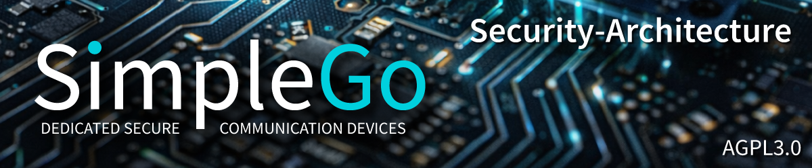

# Security Architecture

**SimpleGo - IT and More Systems, Recklinghausen**
**First native C implementation of the SimpleX Messaging Protocol**

This documentation covers the complete security architecture of SimpleGo across all planned hardware classes. Every design decision, every known vulnerability, and every honest limitation is documented here. Transparency is not a weakness in our security model - it is the foundation.

---

## Hardware Class 1 - ESP32-Based Devices

Hardware Class 1 runs on off-the-shelf ESP32 microcontrollers (ESP32-S3 on LilyGo T-Deck Plus, ESP32-P4 as planned evolution). Security is built from the chip's native eFuse system, HMAC peripheral, and flash encryption capabilities. No external secure elements. Four progressive security modes from fully open (development) to fully locked (production).

**Target audience:** Alpha testers, Kickstarter backers, community developers, security researchers.

| # | Document | Status |
|---|----------|--------|
| 01 | [Overview and Threat Model](./class-1-01-overview-and-threat-model.md) | Complete |
| 02 | [ESP32-S3 eFuse Architecture](./class-1-02-efuse-architecture.md) | Complete |
| 03 | [HMAC-Based NVS Encryption](./class-1-03-hmac-nvs-encryption.md) | Complete |
| 04 | [Known Vulnerabilities and Attack Research](./class-1-04-known-vulnerabilities.md) | Complete |
| 05 | [Attack Equipment Economics](./class-1-05-attack-equipment-economics.md) | Complete |
| 06 | [Runtime Memory Protection](./class-1-06-runtime-memory-protection.md) | Complete |
| 07 | [Post-Quantum Readiness](./class-1-07-post-quantum-readiness.md) | Complete |
| 08 | [Flash Encryption Deep Dive](./class-1-08-flash-encryption.md) | Complete |
| 09 | [Secure Boot V2](./class-1-09-secure-boot-v2.md) | Complete |
| 10 | [Four Security Modes](./class-1-10-four-security-modes.md) | Complete |
| 11 | [ESP32-P4 Evolution Path](./class-1-11-esp32-p4-evolution.md) | Complete |
| 12 | [Implementation Plan](./class-1-12-implementation-plan.md) | Complete |

---

## Hardware Class 2 - Single Secure Element Devices

Hardware Class 2 moves critical key material off the main processor into a dedicated certified secure element (ATECC608B, Microchip, CC EAL5+). The ESP32 or STM32 serves as processor and communication controller only. Private keys are generated inside the secure element and never leave it. This raises the physical attack bar from "laboratory with $2,000 equipment" to "specialized SE attack research."

**Target audience:** Security-conscious users, professional deployments.
**Hardware:** Custom PCB Model 2 (STM32U585 + single SE). Downgrade variant of Model 3 via DNP (Do Not Populate).

| # | Document | Status |
|---|----------|--------|
| 01 | [Overview and Architecture](./class-2-01-overview.md) | Coming soon |

---

## Hardware Class 3 - Triple-Vendor Secure Element Devices ("Vault")

Hardware Class 3 distributes trust across three secure elements from three independent manufacturers: ATECC608B (Microchip, USA), OPTIGA Trust M (Infineon, Germany), SE050 (NXP, Netherlands). Even if one vendor's chip contains a backdoor or undiscovered vulnerability, the complete key cannot be reconstructed from a single compromised element. This is a novel concept with no known precedent in any commercial, military, or academic device.

**Target audience:** Journalists, activists, high-security environments, organizations requiring maximum physical attack resistance.
**Hardware:** Custom PCB Model 3 "Vault" (STM32U5A9 + triple SE + tamper detection + supercapacitor zeroization).

| # | Document | Status |
|---|----------|--------|
| 01 | [Overview and Architecture](./class-3-01-overview.md) | Coming soon |

---

## Cross-Class References

The following documents from the main SimpleGo documentation are closely related to this security documentation:

| Document | Location | Relevance |
|----------|----------|-----------|
| Architecture and Security | `ARCHITECTURE_AND_SECURITY.md` | Master architecture document with SEC-01 through SEC-06 findings |
| Whitespace Analysis | `No_Device_Has_Ever_Combined_These_Six_Security_Features.md` | Market analysis proving SimpleGo's unique feature combination |
| Evgeny Reference | `evgeny_reference.md` | Protocol insights from SimpleX founder, including subscription architecture and networking golden rules |
| Protocol Analysis | `docs/protocol-analysis/` | 44 session documents covering SMP implementation details |

---

## Document Conventions

All documents in this folder follow these conventions:

**Language:** English (matching ARCHITECTURE_AND_SECURITY.md and the wiki at wiki.simplego.dev).

**Depth:** Each document is 5-10 pages, technically precise but compact. Code examples are included where they clarify implementation. CVE numbers and research paper references are cited with dates and authors.

**Honesty policy:** No finding is downplayed. No marketing claim is made without verifiable technical backing. Where Espressif vendor claims diverge from published independent research, the independent research takes precedence and the divergence is noted.

**Frontmatter:** All documents include Docusaurus-compatible YAML frontmatter with title and sidebar_position for integration into wiki.simplego.dev.

**No em dashes.** Regular hyphens or sentence rewrites only.

---

*SimpleGo - IT and More Systems, Recklinghausen*
*AGPL-3.0 (Software) | CERN-OHL-W-2.0 (Hardware)*
