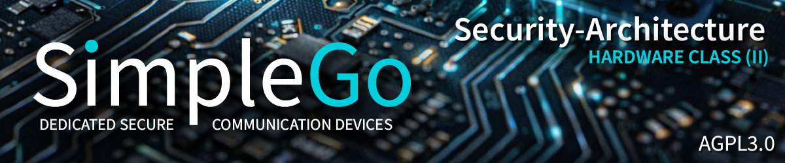

# Hardware Class 2 - Overview and Architecture

**Status:** Coming soon
**Hardware:** Custom PCB Model 2 (STM32U585 + ATECC608B)

---

## What is Hardware Class 2?

Hardware Class 2 moves the critical key vault off the general-purpose processor and into a dedicated secure element. Where Class 1 stores keys in the ESP32's eFuse-encrypted NVS (protected against flash readout but vulnerable to side-channel analysis with laboratory equipment), Class 2 stores keys inside a certified security chip that was designed from the ground up to resist physical attacks.

The ATECC608B (Microchip) is a Common Criteria EAL5+ certified secure element with hardware countermeasures against Differential Power Analysis (DPA), Simple Power Analysis (SPA), timing attacks, and fault injection. Private keys are generated inside the chip's internal random number generator and never leave the chip boundary. Cryptographic operations (ECDH key agreement, ECDSA signing) happen inside the secure element - the host processor sends data in and receives results out, but never sees the raw key material.

This documentation will be published when Hardware Class 2 PCB design begins.

---

## Planned Documentation

| # | Document | Description |
|---|----------|-------------|
| 01 | Overview and Architecture | This document - SE integration model, key hierarchy, threat model |
| 02 | ATECC608B Integration | I2C communication, slot configuration, TrustFLEX provisioning |
| 03 | STM32U585 TrustZone | Secure/non-secure world separation, TAMP pins, RDP levels |
| 04 | Key Lifecycle Management | Generation, rotation, revocation, secure backup |
| 05 | Comparison: Class 1 vs Class 2 | What changes, what stays the same, migration path |

---

*SimpleGo - IT and More Systems, Recklinghausen*
*AGPL-3.0 (Software) | CERN-OHL-W-2.0 (Hardware)*
