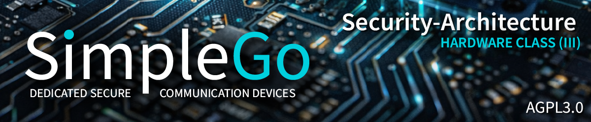

# Hardware Class 3 - Overview and Architecture ("Vault")

**Status:** Coming soon
**Hardware:** Custom PCB Model 3 "Vault" (STM32U5A9 + ATECC608B + OPTIGA Trust M + SE050)

---

## What is Hardware Class 3?

Hardware Class 3 represents the maximum achievable hardware security for a dedicated messaging device. It distributes cryptographic trust across three secure elements from three independent semiconductor manufacturers in three different countries:

| Secure Element | Manufacturer | Country | Certification |
|---------------|--------------|---------|---------------|
| ATECC608B | Microchip Technology | USA | CC EAL5+ |
| OPTIGA Trust M | Infineon Technologies | Germany | CC EAL6+ |
| SE050 | NXP Semiconductors | Netherlands | CC EAL6+ |

The core principle: even if one manufacturer has a hidden backdoor, even if one chip has an undiscovered side-channel vulnerability (as demonstrated by the Eucleak attack on Infineon SLE78 in 2024), the complete key cannot be reconstructed from a single compromised element. This triple-vendor approach has no known precedent in any commercial, military, or academic device.

Additional physical security features planned for Model 3 include active tamper mesh on the PCB, light sensors for enclosure breach detection, a supercapacitor for sub-100ns RAM zeroization on power loss, temperature monitoring, and three physical kill switches (WiFi/BLE, LoRa, LTE).

This documentation will be published when Hardware Class 3 PCB design begins.

---

## Planned Documentation

| # | Document | Description |
|---|----------|-------------|
| 01 | Overview and Architecture | This document - triple-SE model, threat model, physical security |
| 02 | Triple-Vendor Key Splitting | Key distribution across three SEs, threshold schemes, recovery |
| 03 | ATECC608B Deep Dive | Slot config, ECDH in hardware, attestation |
| 04 | OPTIGA Trust M Deep Dive | Shielded Connection, platform integrity, lifecycle management |
| 05 | SE050 Deep Dive | APDU commands, applet architecture, IoT attestation |
| 06 | STM32U5A9 Security | TrustZone, OTFDEC, active tamper pins, RDP Level 2 |
| 07 | Physical Tamper Detection | Mesh design, sensor integration, zeroization response |
| 08 | Duress PIN and Dead Man's Switch | Emergency key destruction, configurable timeouts |
| 09 | Supply Chain Security | Component authentication, anti-counterfeit measures |
| 10 | Comparison: Class 1 vs Class 2 vs Class 3 | Complete feature matrix across all hardware classes |

---

*SimpleGo - IT and More Systems, Recklinghausen*
*AGPL-3.0 (Software) | CERN-OHL-W-2.0 (Hardware)*
